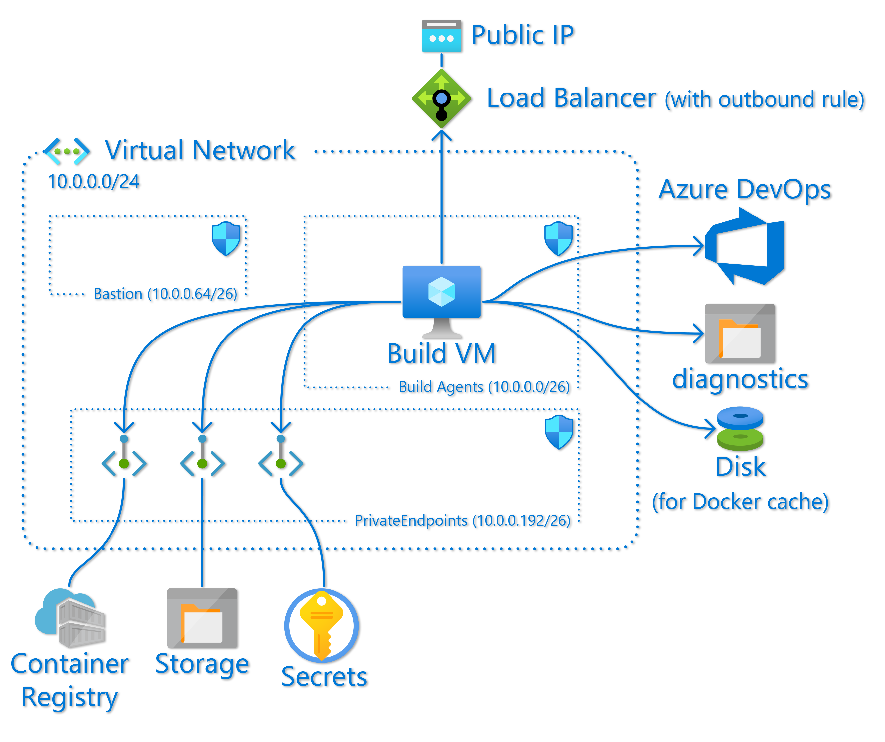

# Azure DevOps Self-hosted Build Agent

This repo contains an [Azure Resource Manager (ARM) template][armtemplate] that can be used to deploy a Linux [self-hosted build agent][selfhostedagent] for [Azure DevOps][azdo].

The templates are defined as Bicep files, then build into a single ARM template that can be deployed to Azure.

The virtual machine is configured using a [__cloud-init__][cloudinit] template which is embedded into the ARM template using the bicep [`loadFileAsBase64()`][loadfileb64] function. To customize the installed packages to your needs edit [`cloud-config.yml`](cloud-config.yml) and re-build the ARM template.

The final setup which includes registering the build agent with Azure DevOps is done by the `vstsagent.sh` bash script. This script sets up a system account for the agent, downloads and installs the latest version of the agent software, and registers it as an agent. It uses a PAT token to authenticate with Azure DevOps and it gets this PAT token from a KeyVault, using the VM managed identity to authenticate with KeyVault. To generate the PAT token see [Authenticate with a personal access token (PAT)][genpat].

The [`vstsagent.sh`](vstsagent.sh) script is copied to the VM by encoding and embedding it into the cloud-init file [`cloud-config.yml`](cloud-config.yml). This is done using the [`BuildVMCloudInit.ps1`](BuildVMCloudInit.ps1) PowerShell script. This reads the `vstsagent.sh` file, ensuring the line endings are all Linux (single line-feed), GZip compresses the contents and base-64 encodes it. The cloud-init file has a placeholder `INSTALLSCRIPT` that is replaced with the encoded script. The resultant cloud-init.yml is written to the `out` subdirectory, which is where the Bicep file will read it from.

The [`vstsagent.sh`](vstsagent.sh) script is run using the [Azure VM Custom Script Extension][customscript]. The main reason for this is to force the deployment to wait on the completion of the cloud-init set-up. The custom script extension runs [`custom-script.sh`](custom-script.sh) which waits on the completion of the cloud-init, runs `vstsagent.sh` and then reboots the VM if needed. As the `vstsagent.sh` script requires arguments that are passed to the ARM template as parameters this file is actually a template that is formatted by the ARM [`format()`][format] function. Any `{` or `}` that are not defining a format placeholder must be escaped with `{{` and `}}`.

The process to build the ARM template is:
 1. Run the [`BuildVMCloudInit.ps1`](BuildVMCloudInit.ps1) PowerShell script.
 2. Run the `bicep build` command.

To simplify this there is a Makefile, so you can just run `make`.

Note the [`Makefile`](Makefile) assumes you have the Azure CLI installed, which is used to install and run Bicep.

The top-level Bicep file that deploys all the required infrastructure is [`build-infra.bicep`](build-infra.bicep). The following section covers all that is deployed with this. If, however, you already have a virtual network that you want to deploy the agent in to, you can use the ['buildvm.bicep'](buildvm.bicep) file, but this does require you to have a pre-existing KeyVault and managed identity that has read access to the KeyVault.

## Build Infrastructure

As mentioned above the [`build-infra.bicep`](build-infra.bicep) file will build to an ARM template that deploys all the infrastructure needed for a private self-hosted build agent virtual machine.

The build infrastructure consists of
  * A virtual network ([`network.bicep`](network.bicep))
  * A load-balancer with a public IP address ([`network.bicep`](network.bicep))
  * A Linux virtual machine to run the build agent (['buildvm.bicep'](buildvm.bicep))
  * An Azure Container Registry for storing container images, Helm charts, etc. generated by pipelines (['container-registry.bicep'](container-registry.bicep))
  * An Azure storage account for storing other generated binary assets. (['storage.bicep'](storage.bicep))
  * An Azure KeyVault for storing the PAT token used to register the build agent, and any other secrets the agent might need. (['keyvault.bicep'](keyvault.bicep))
  * A separate Azure Disk that is mounted in the build VM to store Docker images and cache. (['buildvm.bicep'](buildvm.bicep))
  * A storage account for diagnostic data from the virtual machine. (['buildvm.bicep'](buildvm.bicep))

The virtual network has 3 sub-nets. One for the build virtual machine(s); one for the private endpoints for the container registry, storage account, and KeyVault resources; and one that can be used to deploy an Azure Bastion to provide secure access to the build VM. Each sub-net has an appropriate Network Security Group (NSG) assigned to it.

A load-balancer with a public IP is deployed. This is only configured with an out-bound rule and its purpose is to give the build agent a known outbound public IP address, often needed to allow the agent to access resources through a firewall. If you specify an IP address in the `managementIP` parameter an NSG rule allowing SSH access from this IP to the VM subnet will be created. In this case in inbound NAT pool will also be configured on the loadbalancer, allowing you to SSH directly to the build VMs. This should be used with caution, and can easily be reverted by re-deploying the same template with an empty value for the management IP.

[cloudinit]: https://cloudinit.readthedocs.io/en/latest/ "cloud-init Documentation"
[armtemplate]: https://docs.microsoft.com/azure/templates/ "Define resources with Bicep and ARM templates"
[azdo]: https://azure.microsoft.com/services/devops/ "Azure DevOps"
[selfhostedagent]: https://docs.microsoft.com/azure/devops/pipelines/agents/agents#install
[genpat]: https://docs.microsoft.com/azure/devops/pipelines/agents/v2-linux#authenticate-with-a-personal-access-token-pat "Authenticate with a personal access token (PAT)"
[vmssagents]: https://docs.microsoft.com/azure/devops/pipelines/agents/scale-set-agents
[customscript]: https://docs.microsoft.com/azure/virtual-machines/extensions/custom-script-linux
[format]: https://docs.microsoft.com/azure/azure-resource-manager/templates/template-functions-string#format "Template functions"
[loadfileb64]: https://docs.microsoft.com/azure/azure-resource-manager/bicep/bicep-functions-files#loadfileasbase64